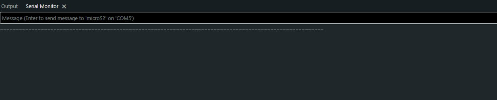

# Controle van de Boardjes

## Overzicht
In dit onderdeel van het project hebben we de ontvangen **S2 Mini**-boardjes gecontroleerd op hun werking.  
Aangezien het project reeds in uitvoering was toen we het overnamen, hadden we beperkte informatie over de originele configuratie en werking van de sensoren.  
Het doel van deze controle was daarom om vast te stellen welke boardjes nog functioneerden en welke defect waren door schade of foutieve bedrading.

## Werkwijze
1. **Aansluiten op Arduino IDE**  
   Elk boardje werd afzonderlijk aangesloten op de computer via USB en herkend in de **Arduino IDE**.  
   We selecteerden de juiste poort en het bijbehorende bordtype (S2 Mini) om de communicatie te starten.

2. **Openen van de seriële monitor**  
   Om te controleren of de boardjes nog data uitstuurden, openden we de **seriële monitor** in de Arduino IDE.  
   De **baudrate** werd ingesteld op **9600**, zodat de data op de juiste snelheid kon worden weergegeven.

3. **Analyse van de ontvangen data**  
   In de seriële monitor kregen we de volgende uitvoer te zien:

   ```
   --------
   ```

   Deze reeks van streepjes herhaalde zich continu.  
   Hoewel we niet precies wisten welk programma of script deze data genereerde, gaf dit resultaat wel aan dat de microcontroller actief data verzond en dus nog werkte.

### Screenshot van de seriële monitor
Ter illustratie is hieronder een screenshot toegevoegd van de ontvangen data in de seriële monitor:



## Observaties
- De aanwezigheid van terugkerende data (`--------`) betekende dat het boardje functioneerde en correct communiceerde via de seriële verbinding.  
- Boardjes die **geen enkele data** terugstuurden, werden als **defect** beschouwd. Dit kon te wijten zijn aan **hardwarematige schade**, **losse verbindingen**, of een **beschadigde USB-controller**.  

## Resultaat
Na het controleren van alle ontvangen S2 Mini-boardjes hebben we de volgende conclusies getrokken:
- De **werkende boardjes** zijn **gelabeld en genummerd** voor latere integratie in het systeem.  
- De **defecte boardjes** zijn apart gelegd en worden niet verder gebruikt.  
- Deze controle bood ons een duidelijk overzicht van het beschikbare werkende hardwaremateriaal voor de verdere ontwikkeling van het project.
