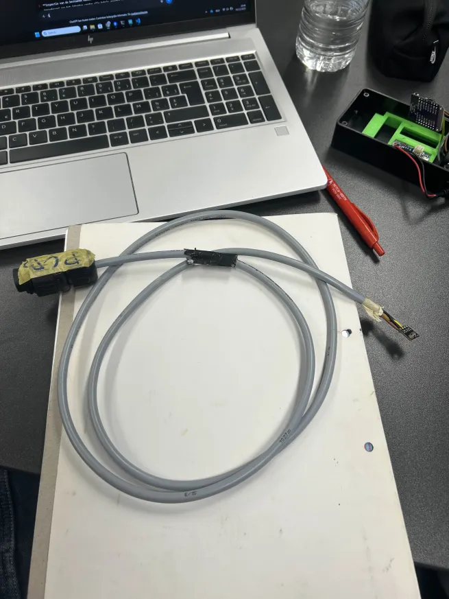

# Aanpassing en Controle van de Sensorbekabeling

## Overzicht
In dit deel van het project hebben we de **sensorbekabeling** van de **SHT3X-sensoren** aangepast en gecontroleerd.  
Tijdens de voorbereidende fase merkten we dat de bestaande kabels te lang waren om een betrouwbare I²C-communicatie te garanderen.  
Het doel van deze aanpassing was om de communicatiekwaliteit tussen de **S2 Mini** en de **SHT3X-sensoren** te verbeteren door de kabellengte te beperken tot een optimale lengte.

## Achtergrond
De **I²C-communicatiebus** (Inter-Integrated Circuit) is gevoelig voor signaalverzwakking en interferentie bij langere kabels.  
Na overleg met de onderzoeker hebben we besloten om de kabels tot ongeveer **1 meter** te knippen, afhankelijk van factoren zoals afscherming, omgeving en de kwaliteit van de verbindingen.  
De oorspronkelijke bekabeling overschreed deze lengte ruim, wat kon leiden tot:
- Onbetrouwbare of incomplete datatransmissie  
- Timingproblemen tussen de master (S2 Mini) en de slave (SHT3X)  
- Hogere kans op storingen door omgevingsruis  

## Werkwijze
1. **Overleg en bepaling van kabellengte**  
   In overleg met de onderzoeker werd besloten om de kabellengte te beperken tot **1 meter**.  
   Dit bood een goede balans tussen flexibiliteit in de opstelling en betrouwbaarheid van de I²C-communicatie.

2. **Inspectie van de bestaande kabels**  
   Voorafgaand aan het inkorten werden alle kabels grondig geïnspecteerd op:
   - Mechanische schade  
   - Corrosie of **waterschade** aan de connectoren en isolatie  
   - Eventuele loszittende verbindingen  

3. **Aanpassing van de lengte**  
   De kabels werden zorgvuldig **afgemeten, op 1 meter afgeknipt** en vervolgens **gestript** om de aders opnieuw te kunnen verbinden.

4. **Herverbinden van de sensor**  
   De **SHT3X-sensoren** werden opnieuw aangesloten volgens de **officiële datasheet**.  
   Hierbij werd gecontroleerd dat:
   - De **VIN**, **GND**, **SCL** en **SDA** pinnen correct waren verbonden.  
   - Er geen kortsluiting of omgekeerde polariteit kon ontstaan.  
   - De verbindingen stevig en schoon waren om betrouwbare datacommunicatie te verzekeren.

5. Validatie van de werking

   De **SHT3X-sensoren** werden aangesloten op een sensormodule met aangepaste firmware waarbij *deep sleep* was uitgeschakeld. Hierdoor verzond de module elke 10 seconden meetgegevens naar Home Assistant.

   De werking van elke sensor werd op twee manieren gevalideerd:

   ### 5.1 Controle via Home Assistant

   De meetwaarden werden opgevolgd via het Home Assistant-overzicht. Deze zijn terug te vinden onder:  
   `Settings` → `Devices & Services` → `ESPHome`.

   

   ### 5.2 Controle via ESPHome logging

   In de aangepaste firmware werd logging geactiveerd door volgende wijziging in het YAML-configuratiebestand:

   ```yaml
   logger:
      level: INFO
   ```

   Hierdoor werd het mogelijk om de werking van de toestellen op te volgen via de ESPHome loggingtool:

   ```bash
   python -m esphome logs device21.yaml
   ```

   #### Logs die correcte werking bevestigen

   ```bash
   [13:01:53.696][W][component:298]: sht3xd.sensor set Warning flag: unspecified
   ```

   #### Logs die aangeven dat de sensor niet correct functioneert

   ```bash
   INFO Trying to connect to envsensor21.local in the background
   INFO Successfully connected to envsensor21 @ 192.168.1.102 in 0.029s
   INFO Successful handshake with envsensor21 @ 192.168.1.102 in 0.045s
   [10:30:46.366][I][app:190]: ESPHome version 2025.11.5 compiled on Dec 13 2025, 10:25:44
   [10:30:46.370][I][i2c.arduino:099]: Results from bus scan:
   [10:30:46.370][I][i2c.arduino:105]: Found device at address 0x08
   [10:30:46.370][E][i2c.arduino:107]: Unknown error at address 0x09
   [10:30:46.370][E][i2c.arduino:107]: Unknown error at address 0x0A
   [10:30:46.370][E][i2c.arduino:107]: Unknown error at address 0x0B

   [10:30:46.695][E][sht3xd:060]:   Communication with SHT3xD failed!
   [10:30:46.698][E][component:154]:   sht3xd.sensor is marked FAILED: unspecified

   [13:02:33.734][I][esp-idf:000]: E (683483) i2c.master: I2C transaction unexpected nack detected
   [13:02:33.734][I][esp-idf:000]: E (683485) i2c.master: s_i2c_synchronous_transaction(945): I2C transaction failed
   [13:02:33.734][I][esp-idf:000]: E (683488) i2c.master: i2c_master_receive(1268): I2C transaction failed
   ```

### Foto van de aangepaste sensorbekabeling
Onderstaande afbeelding toont een voorbeeld van een sensor met de aangepaste kabellengte en correcte aansluiting:



## Observaties
- De kwaliteit van de verbindingen is visueel gecontroleerd en goedgekeurd.
- Naast de visuele inspectie van de verbindingen werd ook een softwarematige controle uitgevoerd via ESPHome-logging en Home Assistant om de correcte werking van de sensoren te bevestigen.
## Resultaat
- Alle sensoren zijn voorzien van **nieuwe, verkorte kabels** van 1 meter lengte.  
- De verbindingen zijn **volgens datasheet** gecontroleerd en bevestigd.  
